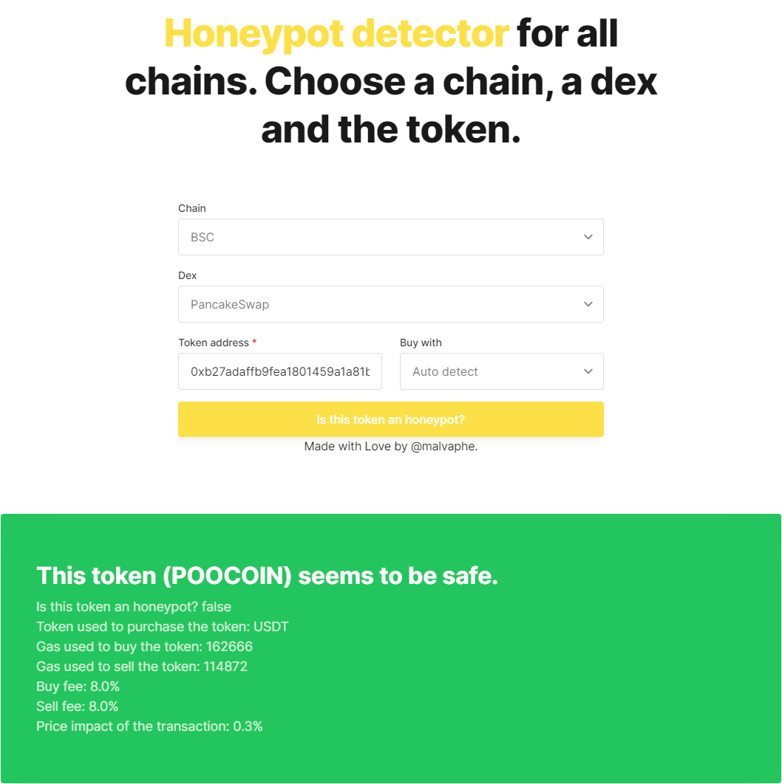

# Crypto Honeypot Detector



An honeypot detector for many chains. The project aims to identify crypto honeypots following these steps:

- You must specify a dex.
- You must specify the token to test and the token to exchange it with.
- The application will try to buy some tokens and then resell them.

## Before running it

First of all clone the project:

```bash
  git clone https://github.com/Tunki1201/Crypto-Honeypot-Detector
```

Then follow these instructions or the project won't work:

- The project is based on the use of contracts distributed in the blockchains.
- Before running the project you must deploy the contract in the blockchains you are interested in.
- The contract is in the Crypto-Honeypot-Detector/contract/multicall.sol file.
- After the deployment, you need to transfer tokens to the contract.

#### BSC deployment example:

You have deployed the contract and now you have the contract address.

You need to transfer some WBNB and some BNB to pay the transaction fees (they will not really be spent, they are used for simulation).

#### The BNBs must be sufficient to cover virtually all transactions.

#### You can take the tokens back at any time through the contract.

Depending on the transferred amount you need to modify all the dexs in Crypto-Honeypot-Detector/apis/dexs who use that chain.

In this case only PancakeSwap.js.

```javascript
const mainTokentoSell = 'the amount of WBNB you have transferred';
```

#### After doing this in all the chains you are interested in, edit the Crypto-Honeypot-Detector/config/const.js file by entering the contract addresses and your address:

```javascript
export const BSCaddress = '';
export const ETHERaddress = '';
export const AVAXaddress = '';
export const FTMaddress = '';
export const MATICaddress = '';
export const XDAIaddress = '';
export const ownerAddress = '';
```

## Run it

Go to the project directory:

```bash
  cd Crypto-Honeypot-Detector
```

Install dependencies:

```bash
  npm i
```

Run the project:

```bash
  npm start
```

## API Reference

```http
  GET /api/${dex}/${tokenAddress}/${mainTokenAddress}
```

| Parameter          | Type     | Description                                     |
| :----------------- | :------- | :---------------------------------------------- |
| `dex`              | `string` | **Required**. Dex where to exchange the token   |
| `tokenAddress`     | `string` | **Required**. Token to test                     |
| `mainTokenAddress` | `string` | **Required**. Token to use to make the purchase |

#### Available dexs:

- pancakeswap (BSC)
- traderjoe (AVAX)
- pangolin (AVAX)
- spookyswap (FTM)
- quickswap (MATIC)
- honeyswap (XDAI)
- sushiswap (ETH)
- uniswap2 (ETH)
- uniswap3 (ETH)

#### If ${mainTokenAddress} equals 'default' the server will use the default mainToken of the chain:

- WBNB for BSC
- WAVAX for AVAX
- WFTM for FTM
- WMATIC for MATIC
- WXDAI for XDAI
- WETH for ETH

## Possible results

Problem testing the token due to a server error (status code 403):

```javascript
{
  error: true,
  msg: 'Error testing the honeypot, retry!'
}
```

Problem testing the token due to a token error (status code 404):

```javascript
{
  error: true,
  data: {
    ExError: true,
    isHoneypot: false,
    tokenSymbol: null,
    mainTokenSymbol: mainTokensymbol,
    problem: true,
    extra: 'Token probably destroyed itself or does not exist!',
  }
}
```

The token does not have enough liquidity for the selected pair (status code 200):

```javascript
{
  data: {
    isHoneypot: false,
    tokenSymbol: tokenSymbol,
    mainTokenSymbol: mainTokensymbol,
    problem: true,
    liquidity: true,
    extra: 'Token liquidity is extremely low or has problems with the purchase!',
  }
}
```

Test completed without errors (status code 200):

```javascript
{
  data: {
    isHoneypot: true/false,
    buyFee: buyTax,
    sellFee: sellTax,
    buyGas: buyGas,
    sellGas: sellGas,
    maxTokenTransaction: maxTokenTransaction,
    maxTokenTransactionMain: maxTokenTransactionMain,
    tokenSymbol: tokenSymbol,
    mainTokenSymbol: mainTokensymbol,
    priceImpact: priceImpact,
    problem: problem,
    extra: extra,
  }
}
* maxTokenTransactionMain is the maximum tradable quantity converted into mainToken.
```

## Configuration

You can configure the project by editing the Crypto_Honeypot_Detector/config/const.js file.

```javascript
// Server port
export const port = 8080;

// Max price impact %
export const priceImp = 2;

// Max safe fee
export const maxBuyFee = 10;
export const maxSellFee = 10;
```